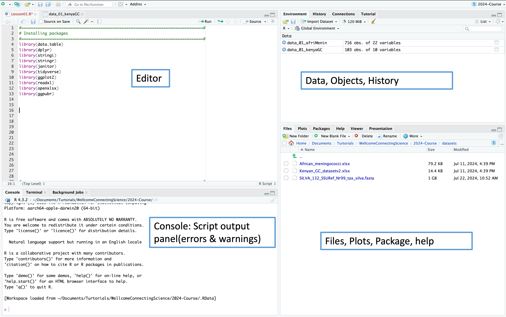

# Practical 1: Getting Started with R — Setup and Loading your Data

**Course:** Molecular and Genomic Approaches to Clinical Microbiology in Africa
**Session:** Lesson 1
**Duration:** ~1 hour 30 minutes

## Learning objectives
By the end of this practical you will be able to:
- Explain the difference between R and RStudio
- Install R and RStudio
- Navigate the RStudio interface
- Create and save an R script
- Assign variables and build a simple data frame
- Install/load packages and import an Excel dataset into R

Work through **Section A**, then **Section B**, then **Section C** in order. Each section ends with a checkpoint — pause there and compare your output with the expected output shown before moving on. Don't worry if you don't finish every task; solutions are provided at the end.

---

## Before you start
You will need:
- A laptop with internet access
- The dataset `African_meningococci.xlsx` (download instructions in Section C)

---

## Section A: Installing R and RStudio, and finding your way around

### A1. What is R vs RStudio?
- **R** is the programming language and statistical engine.
- **RStudio** is a free, open-source Integrated Development Environment (IDE) that gives R a more user-friendly interface.
- You can use R without RStudio, but you cannot use RStudio without R — RStudio needs R installed first.

### A2. Install R
1. Go to the CRAN website: https://cran.r-project.org/
2. Choose your operating system (Windows / macOS / Linux) and download the installer.
3. Run the installer, accepting the default options.

*Expected outcome: R is installed and, on Windows, appears in your Start Menu (or in Applications on macOS).*

### A3. Install RStudio
1. Go to https://posit.co/download/rstudio-desktop/
2. Download the RStudio Desktop installer for your operating system.
3. Run the installer.

*Expected outcome: RStudio opens and automatically detects your R installation.*

### A4. Explore the RStudio layout
Open RStudio. You should see four panes:

| Pane | Location | What it's for |
|---|---|---|
| **Editor** | Top-left | Where you write and save your R script |
| **Console** | Bottom-left | Where code actually runs; shows output, errors and warnings |
| **Environment / History** | Top-right | Shows the objects (data, variables) currently loaded in your session |
| **Files / Plots / Packages / Help / Viewer** | Bottom-right | File browser, plot output, package manager, and help documentation |



*Figure 1. The RStudio interface. The four main areas are the Editor (1), Console (2), Environment/History (3), and Files/Plots/Packages/Help (4).*
**Checkpoint A:** You should be able to point to each of the four panes in RStudio and say what it's for. If you're not sure, ask a facilitator before moving on.

---

## Section B: Writing, running and saving your first script

### B1. Open a new R script
`File > New File > R Script` (or `Cmd/Ctrl + Shift + N`).

### B2. Add a header comment
The `#` symbol is **not a command** — it is used to comment your code. Comments are ignored when the code runs, but they help you (and others) understand what the script does.

```r
#==============================================================================#
# Course Title: Molecular and Genomic Approaches to Clinical Microbiology in Africa
# Date: 13-19 September 2025
# Location: MRC Unit, The Gambia
#==============================================================================#
```

### B3. Assign your first variable
In the **console**, type each line below and press Enter after each one.

```r
x <- 10
x
```

**Expected output:**
```
[1] 10
```

There are three ways to assign a value in R. `<-` (Method 1) is the preferred style used throughout this course.

```r
x <- 10     # Method 1: preferred
x = 10      # Method 2: works, but avoid in scripts
assign("x", 10)  # Method 3: rarely used directly
```

### B4. Assign multiple values to a variable
A single value can be assigned directly, but **multiple values must be combined with `c()`** (short for "combine").

```r
# This will NOT work:
x <- 10, 20, 30, 40
# Error: unexpected ',' in "x <- 10,"

# This is correct:
x <- c(10, 20, 30, 40)
x
```

**Expected output:**
```
[1] 10 20 30 40
```

### B5. Task — Build a small data frame
Using the console or a new block in your script, create three variables and combine them into a data frame, following this table:

| month | male | female |
|---|---|---|
| Jan | 20 | 40 |
| Feb | 30 | 30 |
| March | 40 | 20 |

```r
male   <- c(20, 30, 40)
female <- c(40, 30, 20)
month  <- c("Jan", "Feb", "March")

df <- data.frame(male, female, month)
df
```

**Expected output:**
```
  male female month
1   20     40   Jan
2   30     30 Feb
3   40     20 March
```

### B6. Run your code
There are three ways to run a line/selection of code from the **Editor**:
1. Click into the line, then click the green **Run** button.
2. Highlight the code, then click **Run**.
3. Highlight the code and press **Ctrl + Enter** (Windows/Linux) or **Cmd + Enter** (Mac) — this is the fastest method.

### B7. Save your script
`File > Save As...` and give it a sensible name, e.g. `Lesson01.R`. Always save with the `.R` extension.

> 📸 **Screenshot to include:** The `Save As` dialog box (Lesson 1 slide "Saving your code").

**Checkpoint B — Bioinformatics eyesight test:** For each line below, decide whether it is valid R syntax (✔) or will throw an error (✘). Try running each one yourself to check.

```r
install.package(data.table)
install.packages(data.table)
install.packages("data.table")
libary(data.table)
library("data.table")
library(data.table)
require(data.table)

month <- c("Jan" "Feb" "March")
month <- c(Jan Feb March)
month <- c("Jan", "Feb", "March")
female <- c(40, 30, 20)
```

(Solutions in the final section of this document.)

---

## Section C: Installing packages and loading your dataset

### C1. Install and load required packages
Installing a package downloads it (only needs to be done once per computer). Loading it with `library()` makes it available in your current session (needs to be done every time you start a new R session).

```r
# Install once (skip if already installed on the training VM)
install.packages("openxlsx")
install.packages("dplyr")
install.packages("janitor")
install.packages("stringi")
install.packages("ggplot2")
install.packages("lubridate")

# Load every session
library(openxlsx)
library(dplyr)
library(janitor)
library(stringi)
library(ggplot2)
library(lubridate)
```

Use `search()` to check which packages are currently loaded in your session:

```r
search()
```

### C2. Download the dataset
Two options:
- **From GitHub:** [`African_meningococci.xlsx`](../datasets/African_meningococci.xlsx) — click the download icon on the raw file page.
- **From the training virtual machine:** the file is already available in `datasets/African_meningococci.xlsx`.

> 📸 **Screenshot to include:** The GitHub file listing with the download icon circled (Lesson 1 slide "Download the Datasets").

### C3. Set up an R Project (recommended)
Working inside an R Project keeps your file paths simple and reproducible.

`File > New Project > Existing Directory`, then browse to the folder containing your `datasets/` folder.

### C4. Load the dataset into R
```r
data_01_Africa <- read.xlsx(xlsxFile = "datasets/African_meningococci.xlsx")
```

> ⚠️ Common mistakes to avoid:
> - Do **not** use square brackets: `read_excel[path = "..."]` ✘
> - Do **not** leave the file path unquoted: `read_excel(path = ../inputs/African_meningococci.xlsx)` ✘
> - Do use quotes around the full path: `read.xlsx(xlsxFile = "datasets/African_meningococci.xlsx")` ✔

### C5. Confirm the dataset loaded correctly
Look in the **Environment** pane (top-right). You should see:

```
Data
  data_01_Africa    716 obs. of 22 variables
```

> 📸 **Screenshot to include:** The Environment pane showing `data_01_Africa` with 716 obs. of 22 variables (Lesson 1 slide "Confirm the Dataset is within R").

**Checkpoint C:** Click the blue arrow next to `data_01_Africa` in the Environment pane to expand it and confirm you can see the column names.

---

## End-of-practical summary
You should now be able to:
- [ ] Explain what R and RStudio are, and how they relate to each other
- [ ] Identify the four RStudio panes
- [ ] Write, run and save an R script
- [ ] Assign single and multiple values to a variable
- [ ] Build a simple data frame with `data.frame()`
- [ ] Install and load R packages
- [ ] Import an `.xlsx` file into R with `read.xlsx()`

---

## Solutions

### B7 checkpoint — Bioinformatics eyesight test
| Line | Valid? | Why |
|---|---|---|
| `install.package(data.table)` | ✘ | Function name should be `install.packages` (plural), and the package name must be a quoted string |
| `install.packages(data.table)` | ✘ | Package name must be a quoted string: `"data.table"` |
| `install.packages("data.table")` | ✔ | Correct |
| `libary(data.table)` | ✘ | Typo — should be `library` |
| `library("data.table")` | ✔ | Correct — quotes are optional for `library()` |
| `library(data.table)` | ✔ | Correct — quotes are optional for `library()` |
| `require(data.table)` | ✔ | Correct alternative to `library()` |
| `month <- c("Jan" "Feb" "March")` | ✘ | Missing commas between strings |
| `month <- c(Jan Feb March)` | ✘ | Missing commas, and values must be quoted strings |
| `month <- c("Jan", "Feb", "March")` | ✔ | Correct |
| `female <- c(40, 30, 20)` | ✔ | Correct |

### B5 task — Data frame
```r
male   <- c(20, 30, 40)
female <- c(40, 30, 20)
month  <- c("Jan", "Feb", "March")
df <- data.frame(male, female, month)
df
```
Output:
```
  male female month
1   20     40   Jan
2   30     30 Feb
3   40     20 March
```

---
*Next: [Practical 2 — Exploring and Cleaning Data with R](Practical_2_Exploring_and_Cleaning_Data.md)*
