# Molecular and Genomic Approaches: Bacterial Meningitis Diagnosis and Surveillance in Africa

28 September – 2 October 2026, 
Centre Suisse de Recherches Scientifiques (CSRS), Côte d'Ivoire

## Topic: Web-based genomics

**Instructors: Dr. Keith Jolley and Prof. Martin Maiden**

## Learning outcomes

Participants will:
* Gain an understanding of sequence-based typing.
* Learn to use online typing databases.
* Practice using web-based genomic epidemiology tools.

## Practical 1: Introduction to molecular sequence typing using PubMLST

PubMLST.org (https://pubmlst.org) is a free online web-based resource that supports sequence typing nomenclature as well as containing extensive isolate and genome libraries.

In this practical we will be using the PubMLST *Neisseria* database to identify MLST alleles, sequence types (STs), and the finetyping antigen peptide (PorA and FetA) variants, for a set of capsular group X meningococcal isolates from Africa. Sequence data for these can be found at https://github.com/WCSCourses/Bacterial_Meningitis_Africa_2026/tree/main/course_data_2026/sequence_typing.

First download and open the Excel worksheet (https://github.com/WCSCourses/Bacterial_Meningitis_Africa_2026/tree/main/course_data_2026/sequence_typing/worksheet.xlsx - note that you will need to click the 'Download' link on this page). Fill this in as you go.

If you wish, you can download all the files as a zip archive from https://github.com/WCSCourses/Bacterial_Meningitis_Africa_2026/tree/main/course_data_2026/sequence_typing/data.zip (again note that you will need to click the 'Download' link on this page).

> **Please note that you need to register for a PubMLST account to run the queries necessary for this practical. Please see https://pubmlst.org/site-accounts for details.** 

### Navigating PubMLST
Open a new browser window and type: https://pubmlst.org/neisseria

You will see that the home page is divided into 5 sections:

* A	-	An interactive map summarising all *Neisseria* records in PubMLST;
* B -	‘Typing’: a catalogue of genes annotated in the Neisseria species, including the typing genes PorA, FetA, the capsule locus, and MLST house-keeping genes;
* C -	‘Isolate collection’: a repository of all isolates deposited in the database
* D -	‘Genome collection’; and,
* E -	‘Submit’ where users can submit data for curation and storage in PubMLST.

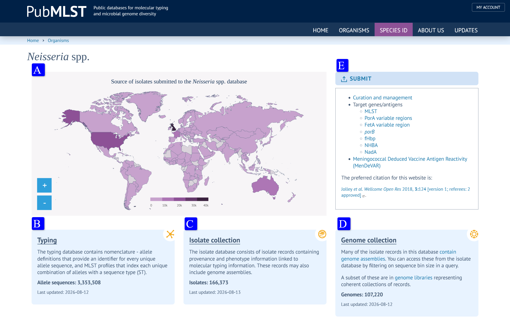

Click 'Typing'.

### Querying sequences

You will see a contents page. To query sequences we will be using the 'Single sequence' query. Click this.

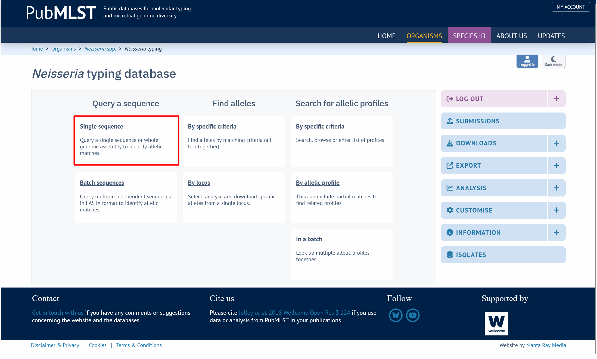

Open the first sequence file [01_BuFa1-11.fas](https://github.com/WCSCourses/Bacterial_Meningitis_Africa_2026/tree/main/course_data_2026/01_BuFa1-11.fas). You will see DNA sequence for the MLST loci (*abcZ*, *adk*, *aroE*, *fumC*, *gdh*, *pdhC*, and *pgm*) as well as for the *porA* and *fetA* genes. You can query a single sequence by copy and pasting it into the web form and selecting the locus. Try this for the *abcZ* sequence, selecting this locus in the dropdown box.

> Make sure you select 'abcZ' and not 'abcZ (NEIS1015)' as this is not the gene fragment used in MLST - it is the full length gene used in cgMLST.

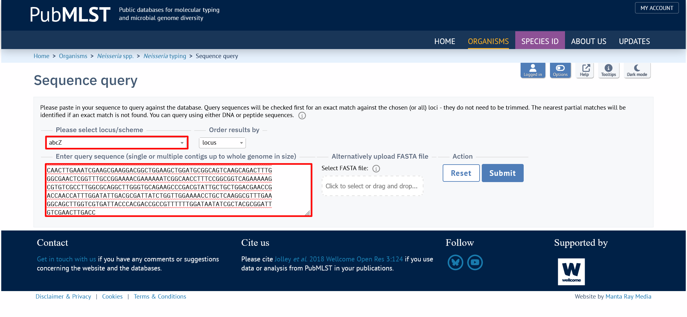

Click 'Submit'.

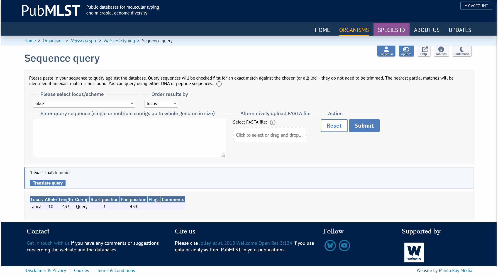

This should have identified the sequence as abcZ-10. Fill this result in your spreadsheet and continue with the other loci. For the PorA results you will need to select 'PorA_VR1' and 'PorA_VR2' loci, and for the FetA results select 'FetA_VR'.

> Note that what is happening behind the scenes here is that the software is creating a BLAST database of known *abcZ* alleles, performing a query of your pasted in sequence against this, and then interpreting the results of the BLAST query for output on the web page.

### Looking up a ST number
When you have a complete MLST profile, you can look up the ST number for it. From the contents page, click the search for allelic profiles 'by allelic profile' link.

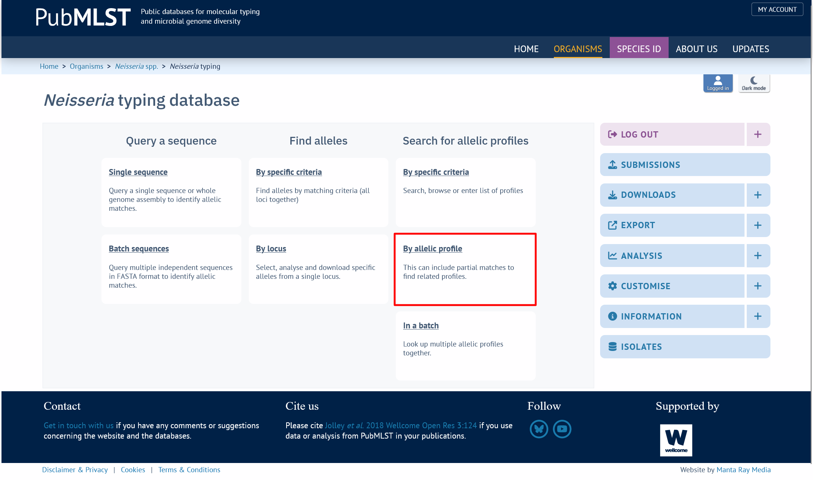

Enter the allelic profile in the boxes and click 'Search'.

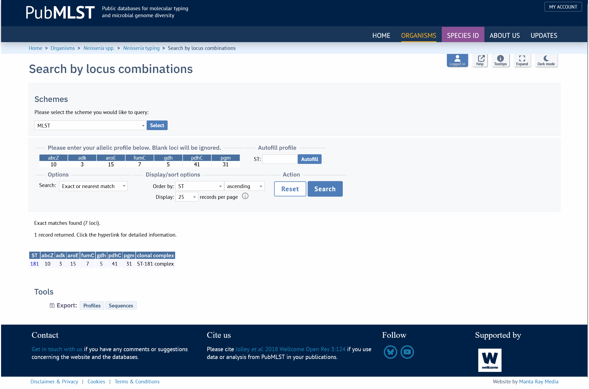

Enter the result in your spreadsheet.

### Speeding it all up
You have probably found that querying each locus in turn is a bit tedious :-). Fortunately you can paste in the entire sequence file into the search box (it will accept even whole genome assemblies) and select  either 'MLST' or 'Finetyping antigens' in the locus box. This will search either all the MLST loci, or all the finetyping loci in one go and return the results. In the case of MLST, it will even look up the ST number if it finds a complete profile. If you have downloaded the sequences to your local computer you can also drag-and-drop the file rather than pasting.

Try to complete the rest of the spreadsheet. It should now be much quicker to do.

### Questions

1. How many different STs are present in the dataset?
2. Do some profiles appear to be similar to others? - if so what can you tell from this?
3. How many groups of similar STs are there?
4. Is there any geographical signal present in the data?
5. Are the antigens associated with a particular ST always the same?

## Practical 2 - Whole genome sequence analyses using PubMLST
PubMLST.org (https://pubmlst.org) is a free online web-based resource which uses the Bacterial Isolate Genome Sequence database (BIGSdb) genomics platform. In addition to extensive data libraries (>1,500,000 bacterial isolates and >1,200,000 genomes) PubMLST incorporates typing information and analytical tools for identifying and storing genetic variation on a gene-by-gene basis (1). PubMLST databases are available for many bacterial species, including *Neisseria meningitidis* within the PubMLST Neisseria database, which can be used to type bacteria enabling epidemiological and other investigations. 

In this practical you will use PubMLST to analyse whole genome sequence (WGS) data from meningococci isolated in Africa. These data originate from 716 meningococci obtained 2011-2016 from 11 countries in the meningitis belt and were published in EBioMedicine in 2019 (2). 

> **Please note that you will need to sign up for a PubMLST account and register this with the *Neisseria* isolate database. See https://pubmlst.org/site-accounts.**

### Navigating PubMLST
Open a new browser window and type: https://pubmlst.org/neisseria

You will see that the home page is divided into 5 sections:

* A	-	An interactive map summarising all *Neisseria* records in PubMLST;
* B -	‘Typing’: a catalogue of genes annotated in the Neisseria species, including the typing genes PorA, FetA, the capsule locus, and MLST house-keeping genes;
* C -	‘Isolate collection’: a repository of all isolates deposited in the database
* D -	‘Genome collection’; and,
* E -	‘Submit’ where users can submit data for curation and storage in PubMLST.

Click on ‘Isolate collection'.

You will see a dashboard summary of the information held within the database.

Expand the 'Search' menu by clicking the '+' icon, and then click ‘Search database’.

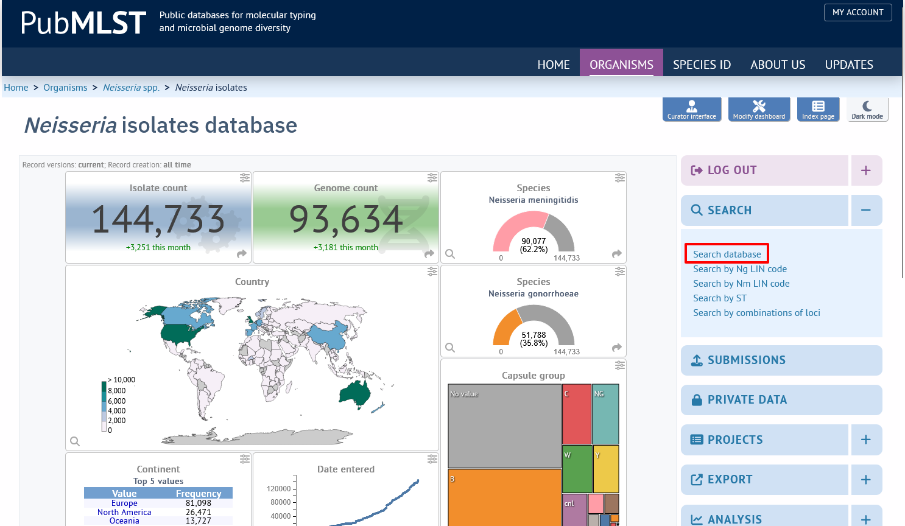

You will see a simple search page which allows you to construct queries consisting of isolate provenance information.

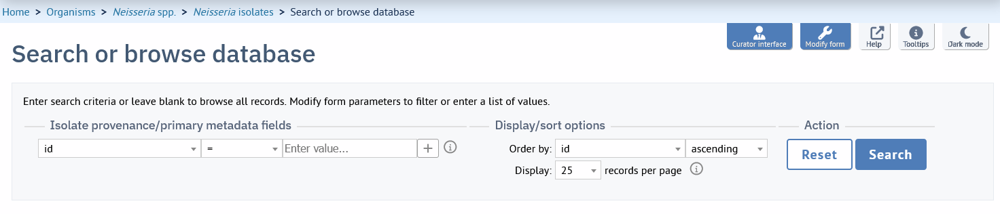

At the time of writing (August 2026), there were whole genome sequence data belonging to over 48,000 meningococci and, for our analyses here, we need to find from these, the 716 meningococci linked to the publication by Topaz et al. 

To do this, we can search for isolates by publication. Additional search criteria can be added by clicking the ‘Modify form' tab using the ‘spanner’ icon on the far right and selecting selected options.

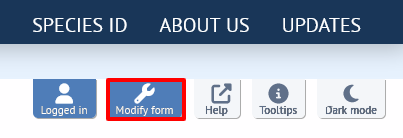

Click the toggle next to 'Filters' which will enable a dropdown filter for publications:

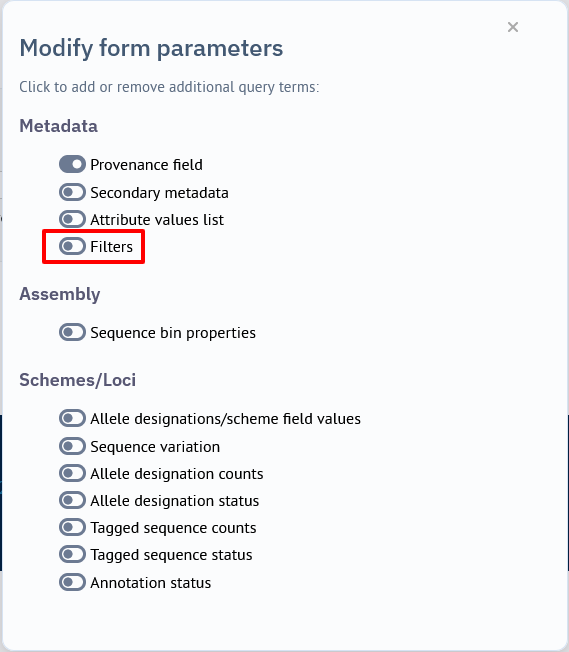

Using the dropdown menu next to Publication, type in the filter box ‘Topaz’, select the resulting publication found (Topaz 2019), then click on SEARCH.

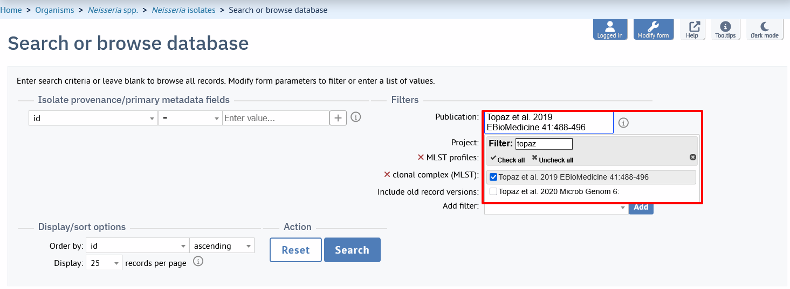

This should return 716 records with a small (customizable) dashboard summarizing the results. Each isolate has a unique ID number, and you can see in the table below some brief information about them, i.e. isolate name, country of origin, year of isolation, MLST ST and clonal complex. 

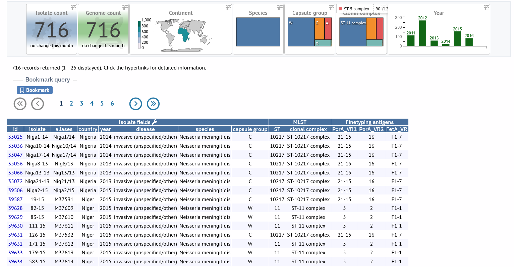

### Analyzing returned datasets
At the bottom of any page of results you will find a number of buttons that will take you to a variety of analysis functions using the results of your query:

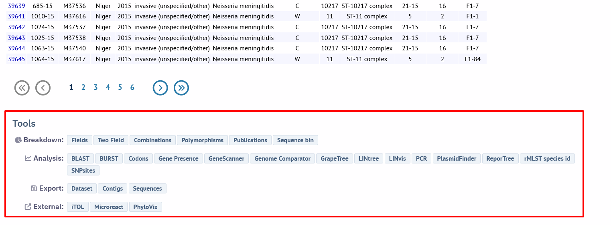

For example, you can breakdown the results by provenance field by clicking the ‘Fields’ button:

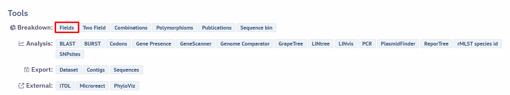

A series of maps and charts will be displayed. You can move between charts by selecting different fields in the dropdown box. Some of the charts can be displayed in different ways, e.g. changing colour scheme or map projection.

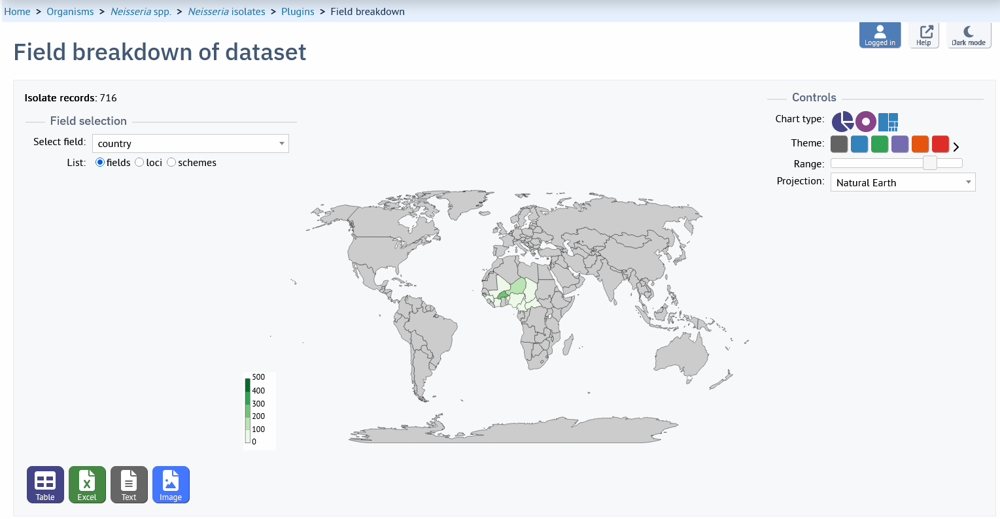

Use the drop-down menu to answers the questions below:

1.	What years do the isolates date from and how many isolates were found in 2015?

2.	Which capsule group was most frequently found in this dataset?

3.	What MLST STs were found? (Hint need to click on the ‘schemes’ radio button). Which STs were the top four most prevalent? 

4.	How does this compare with clonal complex distribution?

The data can also be exported in text or Excel formats. 

You can also break one field down against another using the ‘Two Field’ breakdown:

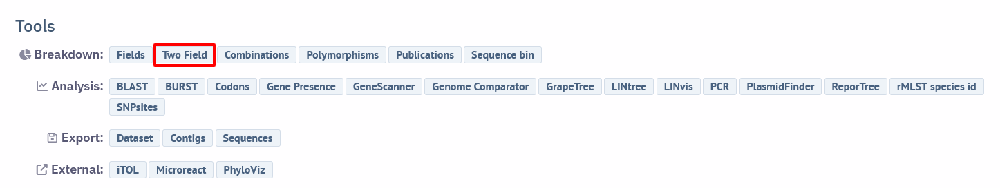

This allows you to combine any field. For example, country vs capsule group:

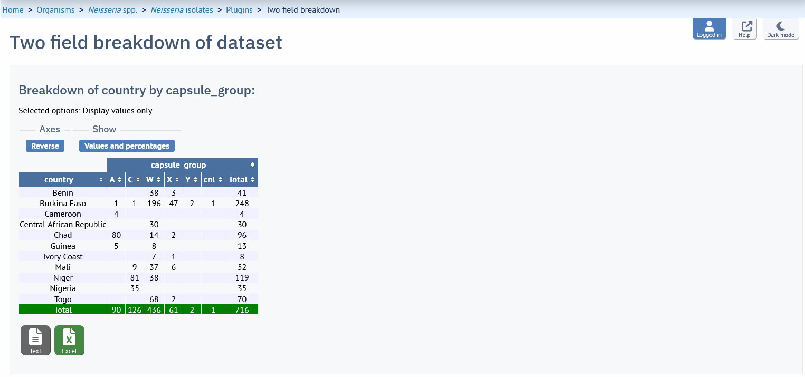

Use the 'Two field' query to answers the questions below:

1.	Which year had the most group C isolates?

2.	Which clonal complex do the group C isolates belong to?

3.	Which country had the most ST-10217 clonal complex isolates?

4.	What capsule group were ST-11 isolates?

### Phylogenetic analyses
Additional analysis tools are available in PubMLST, which we will use to examine the dataset more closely.

#### Minimum Spanning trees using GrapeTree
Genomic relationships among isolates can be visualized using the tool GrapeTree (3). 

Navigate back to your isolate list and click on ‘GrapeTree’ at the bottom of the results page:

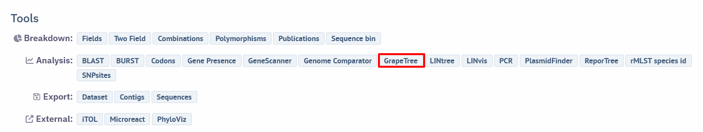

This tool creates minimum-spanning trees (MST) that cluster isolates based on similarities in their allelic profiles. It is important to note that the resulting tree is not based on nucleotide sequences themselves, but on allelic comparisons. This speeds up the analysis and goes a long way to mitigating the effects of horizontal genetic exchange in these organisms.

You should get the following page below:

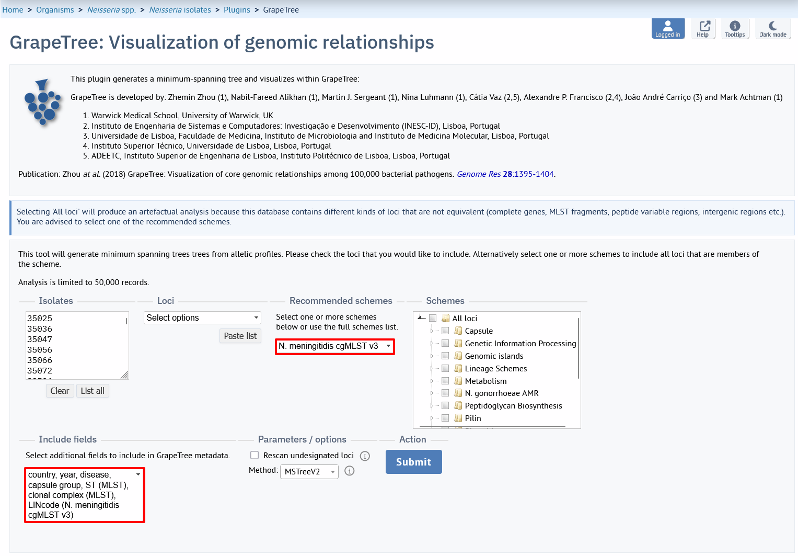

We will compare the isolates using the ‘N. meningitidis cgMLST v3’ scheme. This consists of >1300 loci which have been identified as core genes - defined as those present in more than 98% of the meningococcal genomes examined (4). 

The resulting minimum-spanning tree can be annotated using any associated metadata, which we can select in the ‘Include fields’ section. Select the following options: ‘capsule group’; ‘clonal complex (MLST)’; ‘country’; ‘disease’; ‘ST (MLST)’; ‘year’; and 'LINcode (N. meningitidis cgMLST v3). Click submit. 

The job should take less than a minute to complete. On the resulting page. Click on ‘Launch GrapeTree’.

The following MST will be visible. Each node represents one isolate and clusters of nodes indicate isolates which share allelic profiles in the core genome and are therefore related. Node colours can be changed by expanding the 'Tree Layout' menu and  selecting the metadata field from the 'Node style' dropdown box. Node size can also be altered by dragging the bars on the 'Node size' and 'Kurtosis' (node size relative to number of strains) bars.

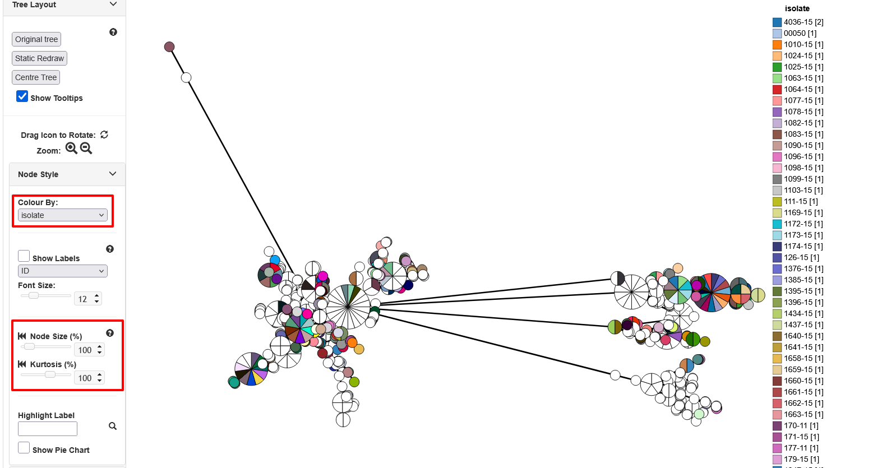

Nodes can be moved around by clicking and dragging them. You can also allow the layout to self-optimize by expanding the 'Rendering' menu, unselecting 'Selected Only' and selecting 'Dynamic' (make sure you do it in that order or it won't work!).

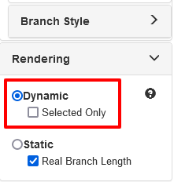

Use the node colouring and labelling options to answer the following questions:

1.	What observations can you make about capsule groups and their distribution in the MST?

2.	How does this relate to the clonal complexes found?

3.	What can you tell about ST-10217 isolates?

Colour schemes can also be altered. Colour the nodes by year, then right click on the legend to change the colour scheme to ‘Gradient: Warm’ and the order grouped by ascending label:

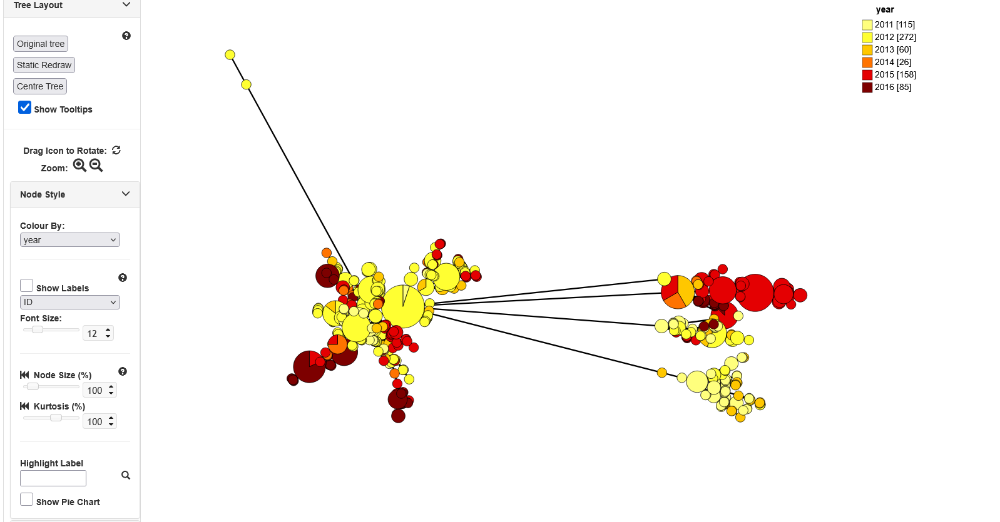

4.	Based on this information what can you deduce about the ST-10217 clonal complex?

Experiment with colouring nodes by LIN codes at different thresholds and compare these with clonal complex. You should see that the first two prefix values, e.g. 57_1, clearly group the complexes.

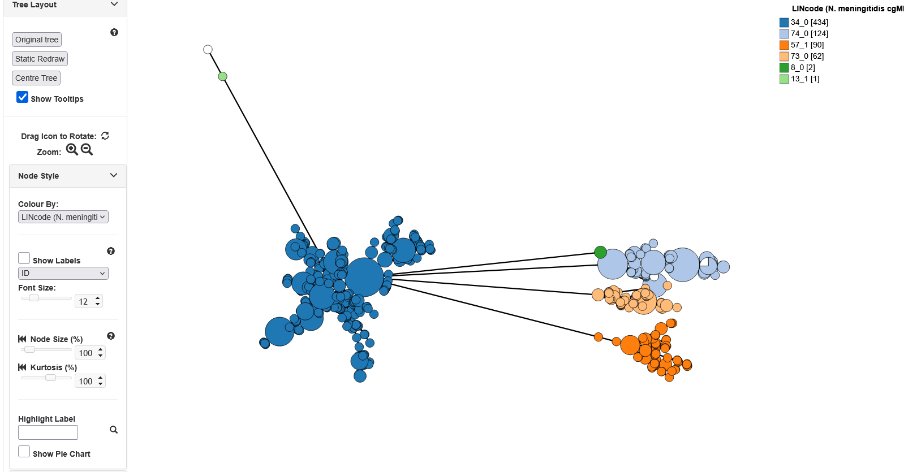

As more of the LIN code threshold prefixes are used, you should see that the complex clusters get further differentiated. The following image uses the first 8 thresholds.

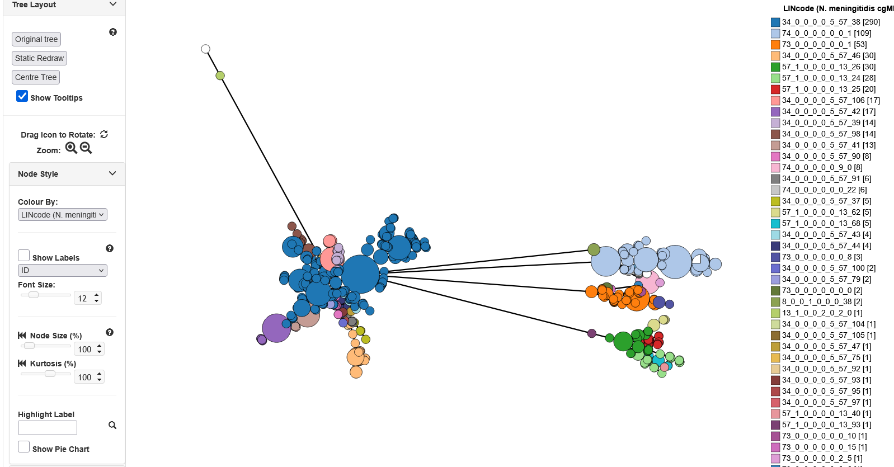

#### Population overviews using LINvis
LINvis is a tool that represents population datasets consisting of LINcodes as dynamic visualisations using circle-packing and sunburst algorithms. These provide an intuitive way of assessing the hierarchical nature and frequency of nodes within the population.

Navigate back to your isolate list and click on ‘LINvis’ at the bottom of the results page:

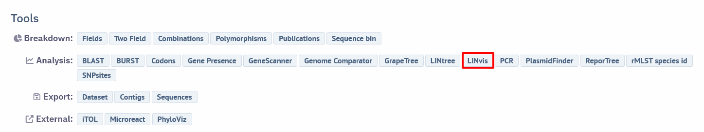

Select the *N. meningitidis* cgMLST v3 scheme and click 'Submit'.

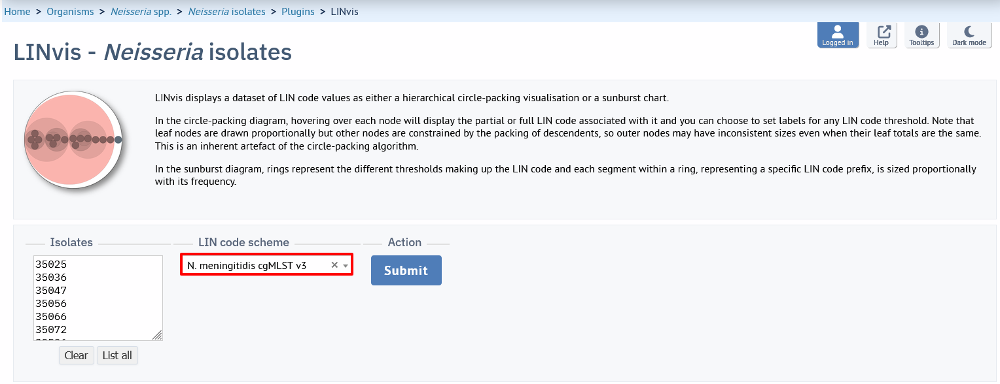

The job will take a few seconds to run and you should then be presented with buttons to launch circle packing and sunburst visualisations. Click 'Launch Circle Packing'.

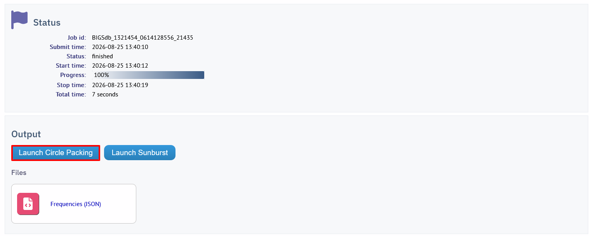

The resulting visualisation represents the LIN codes within the population as a series of packed circles - with the larger outer circles representing the top level of a LIN code prefix, and each inner circle representing each threshold. You can hover over each circle to identify what it represents. The terminal nodes, circles with no child nodes of their own, represent full length LIN codes and their size if proportional to the frequency of the LIN code within the population. It is showing the same information as the last GrapeTree image, but in a different way.

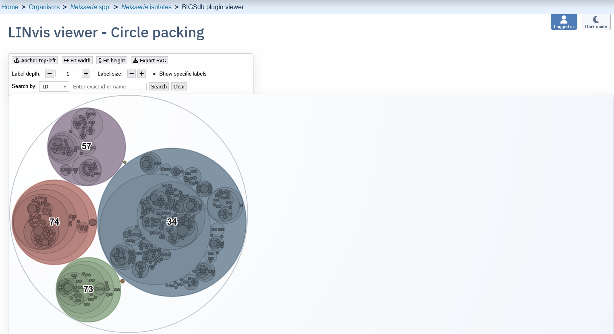

Similarly, if you go back and select the sunburst visualisation, you will see another way of representing the population with LIN codes

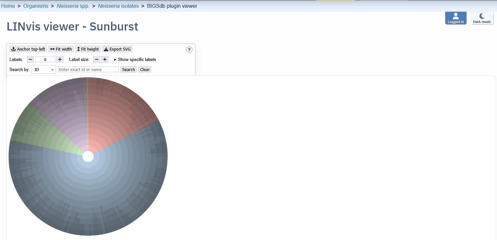

Here the inner ring represents the top-level LIN code threshold, with each outer ring representing further thresholds. The chart is dynamic - click on any segment and it will redraw the chart showing only that part of the dataset.

#### Genome Comparator
Genomes can also be compared using the Genome Comparator tool. This compares isolates using a gene-by-gene method, generates a NeighborNet tree and in addition provides information on the number and precise identification of locus differences among isolates. This tool works particularly well for more highly related isolates. We will use this to analyze ST-10217 isolates. 

Navigate back to your isolate list and select isolates belonging to the ST-10217 clonal complex (note that there is a clonal complex dropdown box in the list of filters).

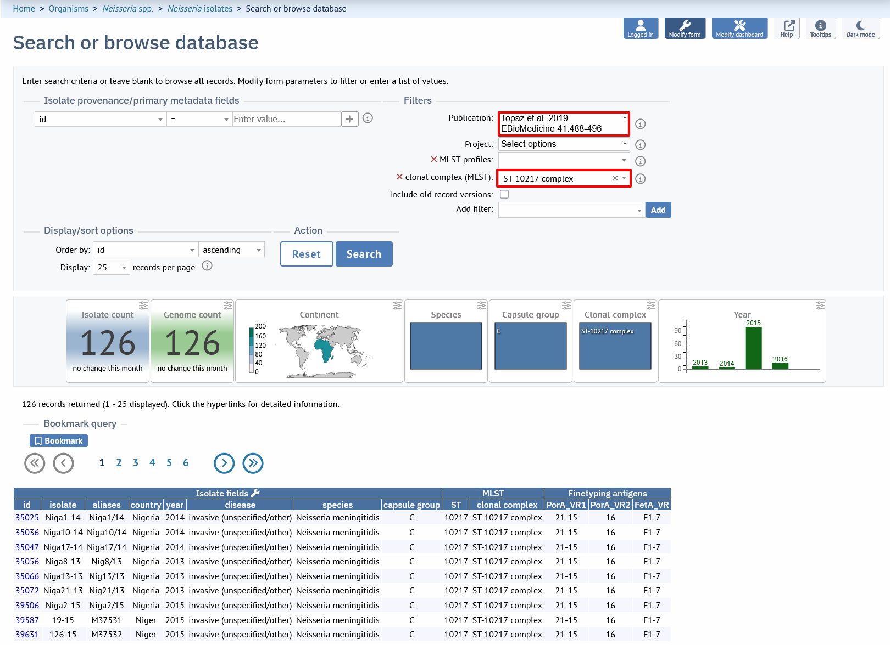

This will return 126 records. At the bottom of the page select ‘Genome Comparator’:

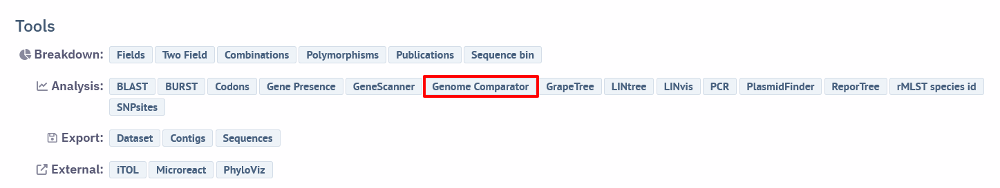

On the following page, select the ‘N. meningitidis cgMLST v3’ scheme. Additional isolate identifiers can be included in the analysis although this should be kept to a minimum to prevent the resulting tree becoming overcluttered. Select isolate, country, and year. Click ‘Submit’.

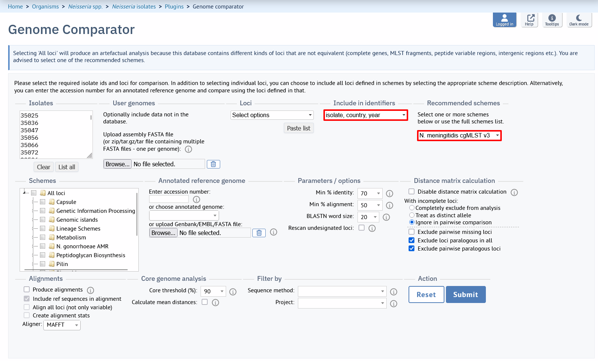

When the analysis is complete, a series of output data will be present. One will be a downloadable Excel spreadsheet with multiple tabs. These various tables show alleles found at each of the loci. Any alleles with the same number (and colour) will be indicative of identical genes. An interesting tab to explore is the ‘Distance Matrix’ tab. This depicts a heat map displaying the number of locus differences between isolates.

Explore these data to answer the following questions:

1.	On average, how many locus differences were found between isolate 39654 originating from Niger and isolates from Nigeria, Burkina Faso and Mali? 

2.	What is unusual about isolate 58398 originating from Mali?

3.	What about isolate 39809?

### Bibliography
1.	Jolley KA, Bray JE, Maiden MCJ. Open-access bacterial population genomics: BIGSdb software, the PubMLST.org website and their applications. [Wellcome Open Res. 2018;3:124](https://pubmed.ncbi.nlm.nih.gov/30345391/).
2.	Topaz N, Caugant DA, Taha MK, Brynildsrud OB, Debech N, Hong E, et al. Phylogenetic relationships and regional spread of meningococcal strains in the meningitis belt, 2011-2016. [EBioMedicine. 2019;41:488-96](https://pubmed.ncbi.nlm.nih.gov/30846392/).
3.	Zhou Z, Alikhan NF, Sergeant MJ, Luhmann N, Vaz C, Francisco AP, et al. GrapeTree: Visualization of core genomic relationships among 100,000 bacterial pathogens. [Genome Research. 2018;28:1395-1404](https://pubmed.ncbi.nlm.nih.gov/30049790/).
4.	Bratcher HB, Corton C, Jolley KA, Parkhill J, Maiden MC. A gene-by-gene population genomics platform: de novo assembly, annotation and genealogical analysis of 108 representative Neisseria meningitidis genomes. [BMC Genomics. 2014;15:1138](https://pubmed.ncbi.nlm.nih.gov/25523208/).

